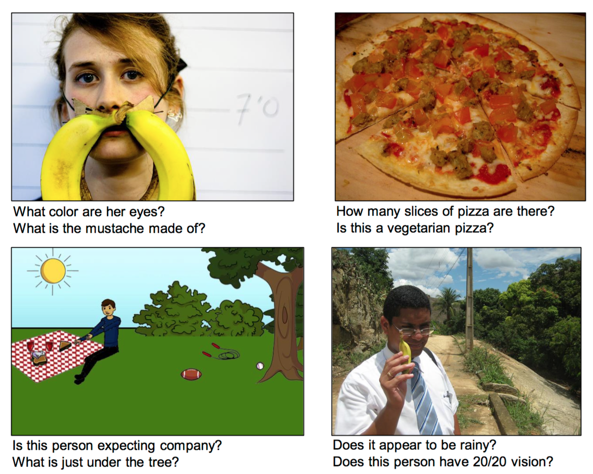
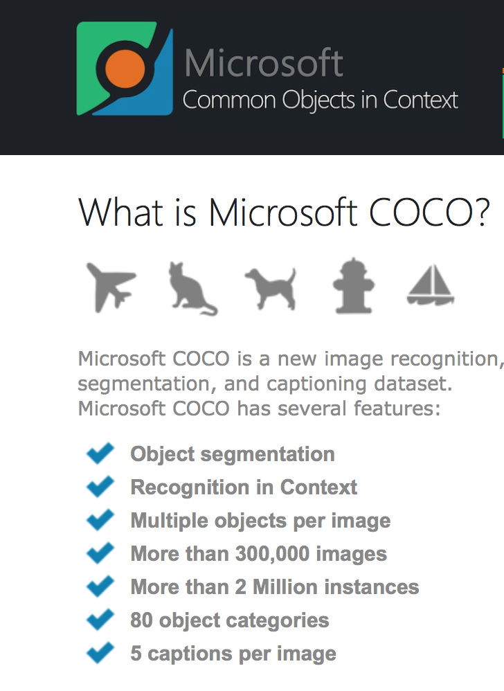
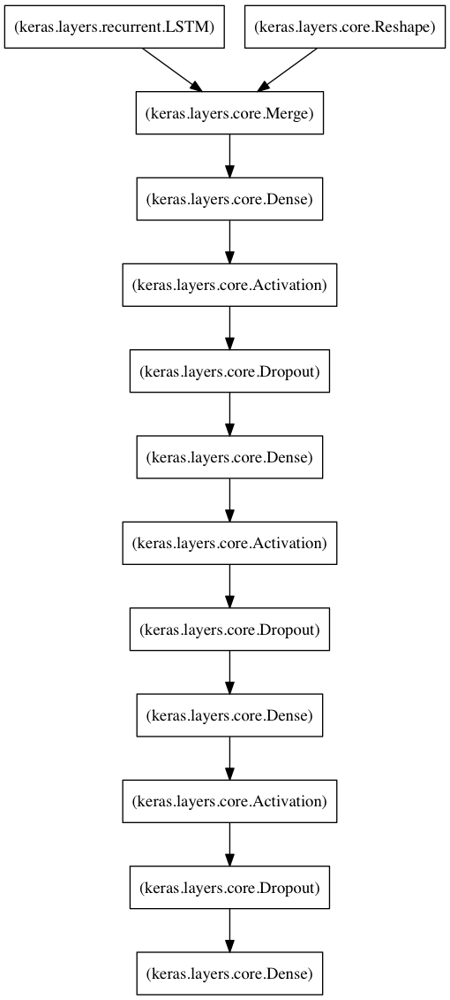
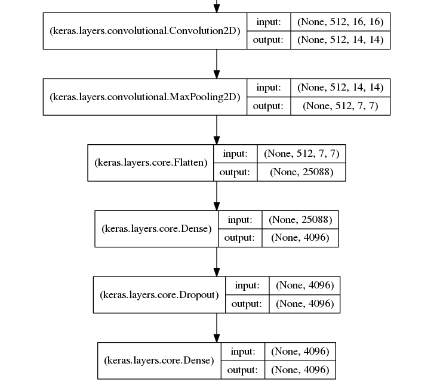
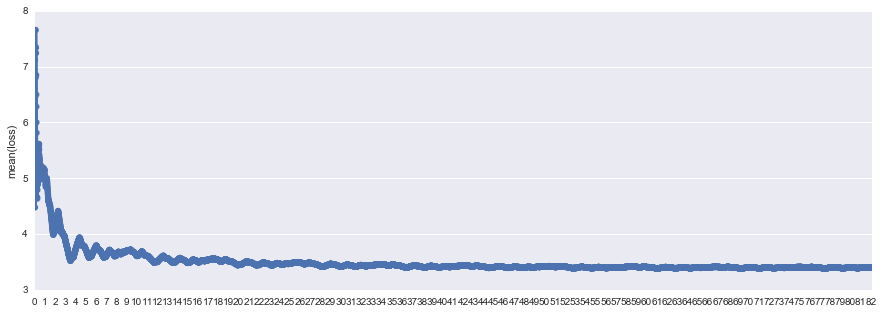
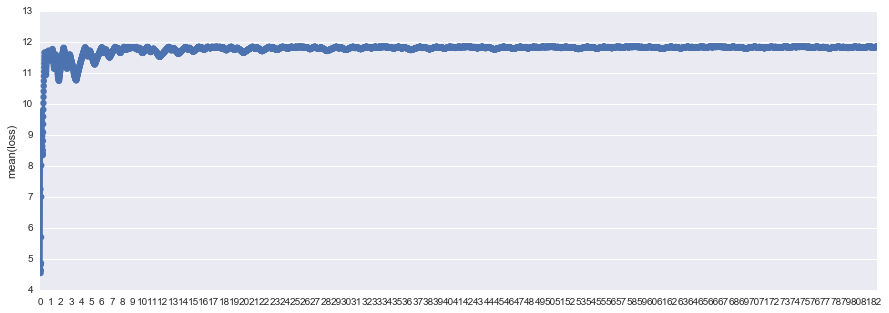
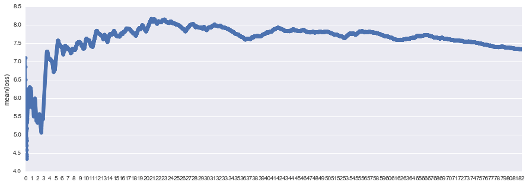

# Visual Question and Answering using MS COCO dataset
---

## Agenda
- Introduction
- Data
- Methodology
- Evaluation
- Testing with new images
- Moving Forward

### VISUALQA.ORG
- Ongoing competition from Virginia Tech and Microsoft 
- successor to the MS COCO image captioning contest
- Has over 250k pictures along with 750k questions and answers

**Resources**

https://github.com/iamaaditya/VQA_Demo
<p>
https://github.com/avisingh599/visual-qa
<p>
https://github.com/VT-vision-lab/VQA_LSTM_CNN
<p>
http://karpathy.github.io



### Questions to Ask
- Can the model understand the question?
- Can the model extract subject of the question and match it to a particular image?
- Can the model give reasonable best guess if match not found?
- Can the model localize segments of the image to identify objects?
- Can the model detect multiple objects in an image?
- How can we get a list of possible answers and their corresponding probabilities?

### Platform and Libraries
- Keras with Theano backend
- spacy word vectors

## Data




## Preprocessing

- CNN model used VGG16(16-layer structure from Visual Geometry Group mean for image classification task) and corresponding weights to train on the images.
    - We wanted to do our own image feature extraction but it would've taken us two weeks in computation time alone.
- Word embeddings - GloVe(Global Vectors for Word Representation) on spacy's platform

## Methodology

### Architecture


### Keras' Built-in Visualization



### Image model



## Model comparison

- **LSTM with RMSprop optimizer**(lr= 0.001, rho = 0.9, epsilon = 1e-06) (as per Karpathy's blog)
    - 24.38 minutes training per epoch
- **GRU with RMSprop optimizer**(lr = 0.001, rho = 0.9, epsilon = 1e-06)
    - 21.37 minutes training per epoch
- **LSTM with SGD optimizer**(lr=0.01, momentum=0.9, decay=0.0, nesterov=True)
    - 18.75 minutes training per epoch
- We also tested GRU with Adam, GRU with SGD, and LSTM with Adam but they were giving us exceptionally high training loss from the first epoch so we stopped them early.

## Evaluation

- Test models to epoch 10
- Because we were getting horrendous evaluation results, our criteria for success in measuring accuracy was, if the correct answer was in the top 10 and top 5 of our answer distribution, it was a success. 


```python
import pandas as pd
three = pd.read_pickle("eva.pkl")
ten = pd.read_pickle("five.pkl")
```


```python
ten
```


<div>
<table border="1" class="dataframe">
  <thead>
    <tr style="text-align: right;">
      <th></th>
      <th>model</th>
      <th>val</th>
    </tr>
  </thead>
  <tbody>
    <tr>
      <th>0</th>
      <td>LSTM+RMSpop</td>
      <td>0.542857</td>
    </tr>
    <tr>
      <th>1</th>
      <td>GRU+RMSprop</td>
      <td>0.495238</td>
    </tr>
    <tr>
      <th>2</th>
      <td>LSTM+SGD</td>
      <td>0.076190</td>
    </tr>
  </tbody>
</table>
</div>


```python
three
```


<div>
<table border="1" class="dataframe">
  <thead>
    <tr style="text-align: right;">
      <th></th>
      <th>model</th>
      <th>val</th>
    </tr>
  </thead>
  <tbody>
    <tr>
      <th>0</th>
      <td>LSTM+RMSprop</td>
      <td>0.219048</td>
    </tr>
    <tr>
      <th>1</th>
      <td>GRU+RMSprop</td>
      <td>0.495238</td>
    </tr>
    <tr>
      <th>2</th>
      <td>LSTM+SGD</td>
      <td>0.057143</td>
    </tr>
  </tbody>
</table>
</div>


**LSTM + RMSprop**



**GRU + RMSprop**



**LSTM + SGD**



# Testing with new images


```python
from prediction import predict

model = 'models/lstm_1_num_hidden_units_lstm_512_num_hidden_units_mlp_1024_num_hidden_layers_mlp_3_num_hidden_layers_lstm_1.json'
weights = 'models/lstm_1_num_hidden_units_lstm_512_num_hidden_units_mlp_1024_num_hidden_layers_mlp_3_num_hidden_layers_lstm_1_epoch_099.hdf5'
image_directory = 'data/mike_photos/bicycle.jpg'
predict(model, weights, image_directory)
```

    Ask a question about the image:what is in the picture?
    09.96 %  bicycle
    04.78 %  bike
    03.91 %  motorcycle
    02.21 %  brick
    01.79 %  dog
    01.62 %  umbrella
    01.62 %  carriage
    01.52 %  motorcycles
    01.35 %  cat
    01.33 %  luggage
    Ask a question about the image:how many wheels does the bike have?
    51.32 %  2
    009.0 %  5
    05.53 %  8
    03.95 %  3
    003.8 %  0
    003.1 %  1
    02.85 %  10
    002.6 %  20
    002.4 %  7
    02.23 %  9
    Ask a question about the image:what direction is the bike facing?
    51.61 %  left
    14.61 %  right
    02.19 %  outside
    01.12 %  man
    00.91 %  no
    000.7 %  yes
    00.49 %  winter
    00.38 %  top
    00.33 %  no one
    00.32 %  fall
    Ask a question about the image:what color is the bike?
    25.66 %  green
    17.14 %  blue
    013.5 %  black
    12.07 %  yellow
    10.57 %  red
    05.81 %  white
    03.55 %  orange
    01.53 %  gray
    01.39 %  purple
    01.21 %  brown
    Ask a question about the image:how many cars in the background?
    51.18 %  2
    09.04 %  5
    05.56 %  8
    03.95 %  3
    03.82 %  0
    03.09 %  1
    02.85 %  10
    02.62 %  20
    002.4 %  7
    02.25 %  9


### Things we have noticed after testing with multiple images
- Counting objects is hardly ever accurate
- Yes/No questions are also usually almost always the opposite
- Determing color of objects is not easy
- Best result is just "what is in the picture?"
- There are limitations to an answer space of 1000 words
    - we input a picture of a rabbit
    - got back bear, cat, duck, seagull...no rabbit or bunny in the answer space

## Challenges / Moving Forward

- TRAINING TIME - We read other participants in the contest were able to get training times of 5 minutes for 20 epochs with a powerful GPU. Must invest in an nVidia graphics card or AWS.
- Once graphics card is purchased, we should try changing the parameters of the optimizer(we used default parameters because of time constraints)
- Evaluate VGG features - we don't know the specifics of the model and whether something about it is causing our discrepant results
- Train our own image features
- Try Multiple Layer LSTMs and compare it with our model
    -Bidirectional LSTMs?

